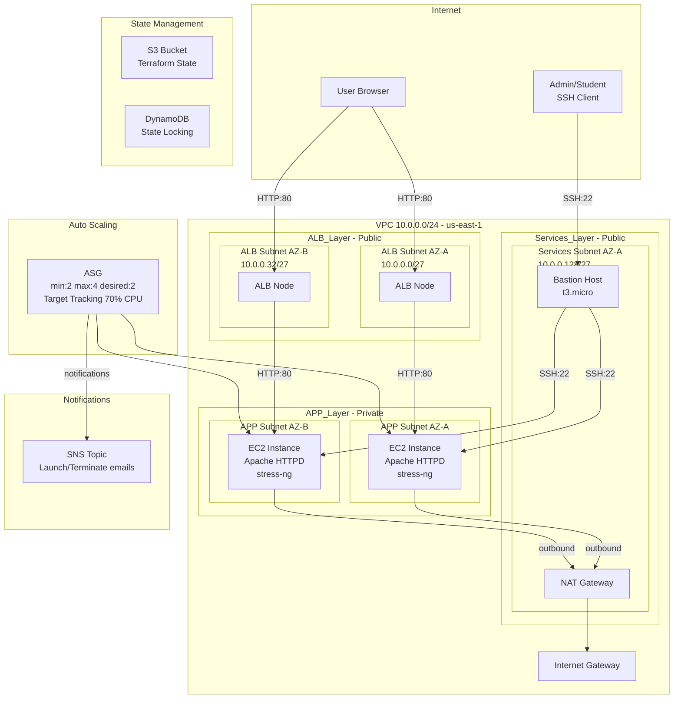
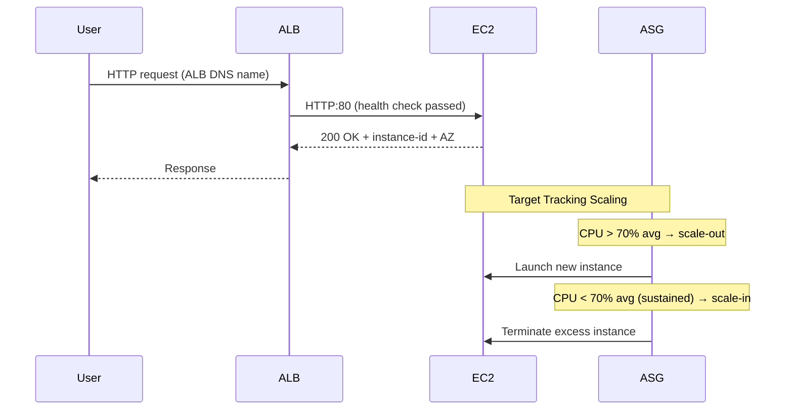
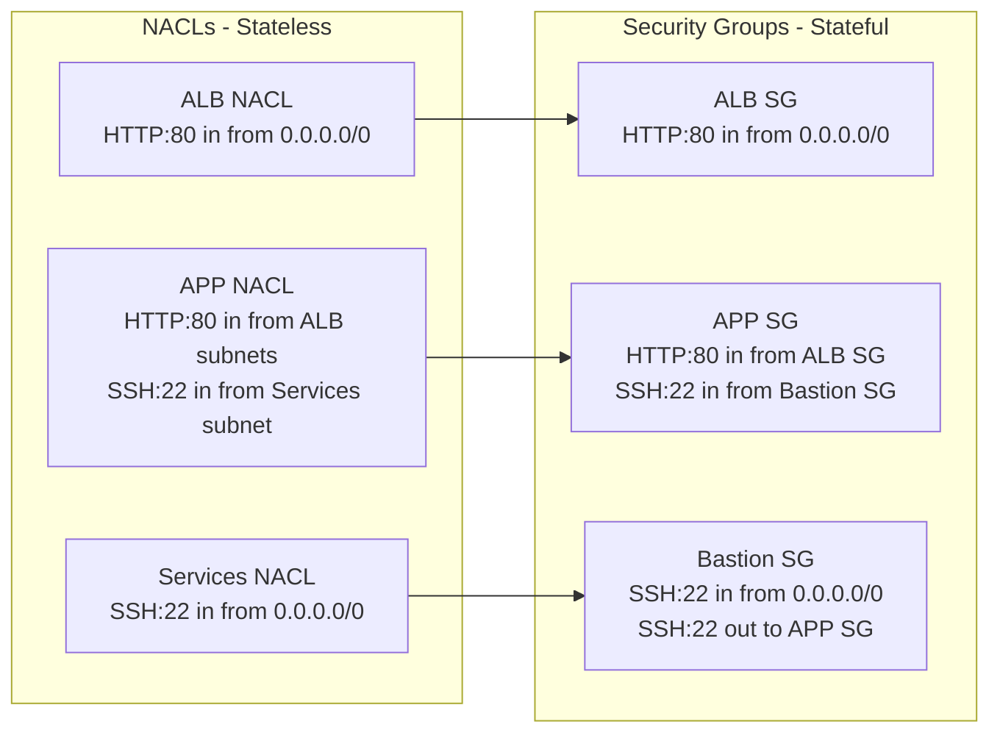

# Architecture — Student Variant

## High-Level Architecture

## Network Flow

## Security Layers

## Subnet Layout

| Subnet | CIDR | AZ | Type | Purpose |
|--------|------|-----|------|---------|
| ALB-1 | 10.0.0.0/27 | us-east-1a | Public | ALB |
| ALB-2 | 10.0.0.32/27 | us-east-1b | Public | ALB |
| APP-1 | 10.0.0.64/27 | us-east-1a | Private | Web servers |
| APP-2 | 10.0.0.96/27 | us-east-1b | Private | Web servers |
| Services | 10.0.0.128/27 | us-east-1a | Public | NAT Gateway + Bastion |

## Key Design Decisions

- **Three-layer subnet architecture**: ALB, APP, and Services layers with dedicated NACLs for defense-in-depth
- **Single NAT Gateway**: Cost optimization — one NAT in Services subnet serves both APP subnets
- **Bastion host**: SSH access to private instances without requiring EC2 Instance Connect permissions
- **Target Tracking scaling**: AWS-managed scaling at 70% CPU target, reacts in 1-5 minutes
- **Unlimited CPU credits**: t3.micro instances can burst to 100% immediately for stress testing
- **Shared key pair**: Same SSH key for bastion and APP instances (stored in SSM Parameter Store)
